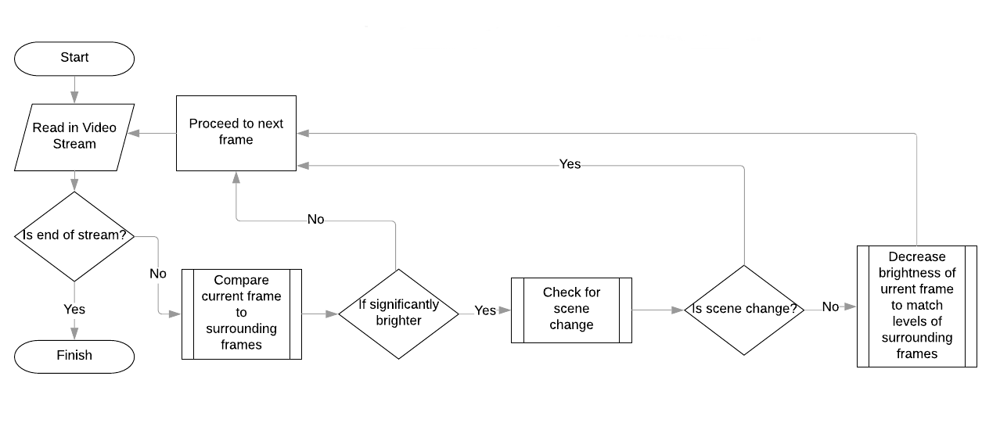

# Pax

 📸 A script which removes flashes from a video stream

## Intro

The aim in developing this module was to use machine vision to detect and eliminate sudden contrast changes, caused mainly by camera speed light. Video footage containing fast flickering images, such as camera flashes is non-accessible for some people with photosensitive epilepsy. It also generally decreases the viewing quality of clips.

## Example

| Before        | After         |
| ------------- |:-------------:|
|  |  |
|  |  |

## Usage Instructions

Once you've cloned and cd'd into the repo, use Python 3 to run the Pax script, for example:

    python3 main.py -i path/to/your/video.mp4 -o path/to/your/dest.mp4 -c mp4v

Where the `--ifile` is your input, `--ofile` is your output, and `--codec` is your chosen, and installed codec

## How It Works

Uses OpenCV to analyse and programmatically adjust frames in a video stream.

The general flow of the program:

## About

*Developed by [Oliver Poole](https://github.com/OlliePoole) and [Alicia Sykes](https://aliciasykes.com) at [StartHack 19](https://starthack.ch/), won 1st place. Licensed under [MIT](https://gist.github.com/Lissy93/143d2ee01ccc5c052a17), 2019.*
