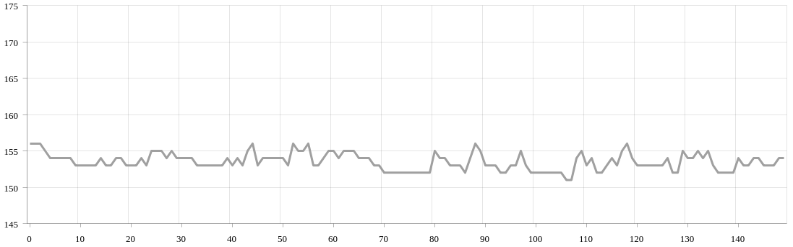

<h1 align="center">Pax 📸</h1>

  <i>Detects and removes camera flashes from a video stream</i> 

## Intro

The aim in developing this module was to use machine vision to detect and eliminate sudden contrast changes, caused mainly by camera speed light. Video footage containing fast flickering images, such as camera flashes is non-accessible for some people with photosensitive epilepsy. It also generally decreases the viewing quality of clips.

_This project is a proof of concept, and as such it is yet optimised for production. _
_It was built at [StartHack 19](https://starthack.ch/) by myself and [Ollie](https://github.com/OlliePoole), and won first place :)_

## Example

| Before        | After         |
| ------------- |:-------------:|
|  |  |
|  |  |

## Usage Instructions

Once you've cloned and cd'd into the repo, use Python 3 to run the Pax script, for example:

    python3 main.py -i path/to/your/video.mp4 -o path/to/your/dest.mp4 -c mp4v

Where the `--ifile` is your input, `--ofile` is your output, and `--codec` is your chosen, and installed codec

## How It Works

<a href="https://vimeo.com/777919376">
  

    
     
    <i>Watch Interview</i>
  

</a>

The general flow of the program:

<!-- License + Copyright -->

  <i>Developed at <a href="https://starthack.ch/">StartHack 19</a>, won 1st place 🏆</i> 
  <i>© <a href="https://aliciasykes.com">Alicia Sykes</a> and <a href="https://github.com/OlliePoole">Ollie Poole</a> 2019</i> 
  <i>Licensed under <a href="https://gist.github.com/Lissy93/143d2ee01ccc5c052a17">MIT</a></i> 
  

<!-- Dinosaur -->
<!-- 
                        . - ~ ~ ~ - .
      ..     _      .-~               ~-.
     //|     \ `..~                      `.
    || |      }  }              /       \  \
(\   \\ \~^..'                 |         }  \
 \`.-~  o      /       }       |        /    \
 (__          |       /        |       /      `.
  `- - ~ ~ -._|      /_ - ~ ~ ^|      /- _      `.
              |     /          |     /     ~-.     ~- _
              |_____|          |_____|         ~ - . _ _~_-_
-->

